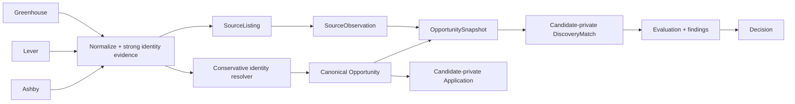

# ADR-009: Conservative canonical Opportunity identity

- Status: Accepted
- Date: 2026-08-31

## Context

Greenhouse, Lever, and Ashby can expose the same vacancy through distinct provider-local records. Treating each record as an Opportunity duplicates candidate matches and intelligence, while fuzzy title/company matching can silently combine different requisitions and corrupt durable evaluation, decision, and application history.

## Decision

`Opportunity` is shared public vacancy identity. `SourceListing` is provider-local identity, uniquely keyed by `(sourceSystem, sourceExternalId)`. `SourceObservation` retains each raw provider observation. `OpportunitySnapshot` is normalized public state, and its many-to-many source links retain every observation supporting that state. `DiscoveryMatch`, Evaluation/findings, Decision, Evidence, Application, Career Signals, and activity projections remain candidate-private and reference the canonical Opportunity without contributing to its identity.

Resolution uses this deterministic hierarchy:

1. An already-linked source listing keeps its Opportunity. Provider changes or disappearance never silently reassign history.
2. Otherwise, match a normalized employer-hosted canonical application/job URL.
3. Otherwise, match an explicit requisition identifier scoped to a canonical employer domain.
4. Otherwise create a separate Opportunity.

URL normalization accepts only HTTP(S), converts the scheme to HTTPS for comparison, lowercases and removes `www.` from the host, removes fragments and default ports, collapses path separators and trailing slashes, sorts query parameters, and removes known tracking/referral parameters including `utm_*`, `gclid`, and `fbclid`. Generic Greenhouse, Lever, and Ashby hosts are source URLs, not cross-source identity. Explicit requisition IDs are normalized for case, Unicode, whitespace, and punctuation; they are never compared without an employer domain. Provider-local external IDs are not comparable across providers.

Role and location are collision guards, not linkage keys. A conflicting normalized role or two conflicting stated locations makes a strong-key collision ambiguous. Display organization, title similarity, skills, description, work model, and candidate data never independently cause a merge. If several keys point to different Opportunities, or a guard conflicts, the incoming listing remains separate and does not claim the contested key. False negatives are preferred to false-positive merges.

Strong keys are durably and uniquely claimed in `opportunity_identity_keys`. Resolution and source-listing association occur in one database transaction. The unique key constraint chooses one winner if concurrent workers first observe the same strong key. Repeated candidate discovery is deduplicated by the existing candidate/search-target/Opportunity match constraint. Equivalent snapshots link all supporting observations even when no new snapshot is needed.

Existing data is preserved. The migration creates an empty identity-key table and performs no heuristic backfill. Existing source associations remain authoritative; new and updated observations establish strong claims going forward.

## Consequences

The same well-identified vacancy can share one Opportunity and all source provenance, while candidate-owned conclusions and actions remain isolated. Some true duplicates remain separate when providers expose no safe common identifier. That is an intentional correctness tradeoff. Fuzzy/aggressive merging, automatic historical title/company backfills, and candidate-derived identity are prohibited.
