# Opportunity Processing

## Status

Conceptual processing flow. Solid arrows are the normal state progression; dashed arrows show optional model assistance that must be validated before domain use.

```mermaid
flowchart LR
    Source[ATS Source]
    Fetch[Fetch]
    Record[Source Record]
    Normalize[Normalize]
    Dedupe[Identity and Deduplicate]
    Persist[Opportunity and Snapshot]
    Eligibility[Eligibility Assessment]
    Fit[Fit Assessment]
    Quality[Quality Assessment]
    Decision[Explainable Decision]
    Dashboard[Dashboard and API]
    Model[Optional Model Assistance]

    Source --> Fetch
    Fetch --> Record
    Record --> Normalize
    Normalize --> Dedupe
    Dedupe --> Persist
    Persist --> Eligibility
    Eligibility --> Fit
    Fit --> Quality
    Quality --> Decision
    Decision --> Dashboard

    Record -. ambiguous requirement proposal .-> Model
    Persist -. bounded evidence .-> Model
    Model -. validated claims or explanations .-> Eligibility
    Model -. validated semantic match proposals .-> Fit
    Model -. validated risk interpretation .-> Quality
```

## Processing classifications

- **Deterministic first:** fetch orchestration, structured parsing, normalization, exact identity signals, explicit phrase extraction, snapshot persistence, and the Hard Blocker rule.
- **Model-assisted where useful:** ambiguous Requirement interpretation, semantic or transferable-skill proposals, and bounded Quality interpretation.
- **Always preserved:** raw/source references, Evidence, unknowns, contradictions, input versions, and failures.
- **Never automatic:** an uncertain duplicate merge, unsupported Candidate Claim, or application submission.

Cheap deterministic processing occurs before optional expensive intelligence. If a model step fails, the retained Source Record, OpportunitySnapshot, and deterministic results remain valid and the Evaluation is visibly partial.
