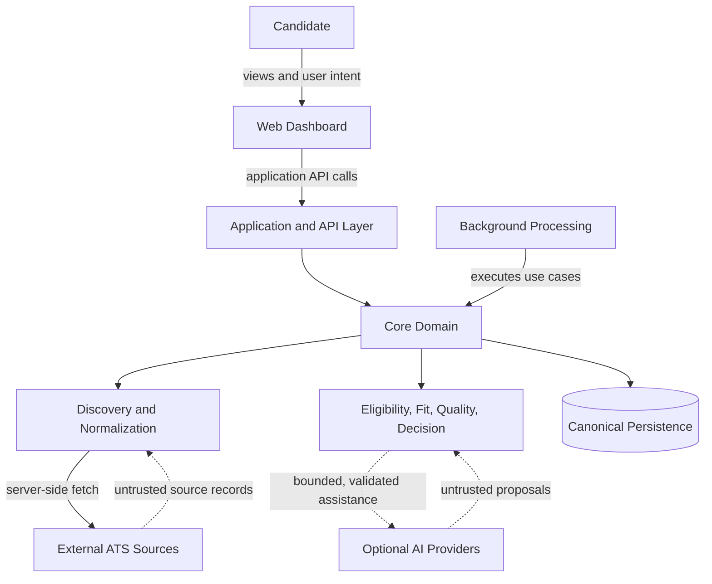

# System Context

## Status

Conceptual architecture for the first usable version. Logical components shown here do not imply separate microservices or deployment units.

## Boundary notes

- The Web Dashboard renders data and captures intent; it does not own Eligibility or ranking rules.
- The Application/API and Background Worker use the same Core Domain behavior.
- Discovery retains source provenance and treats external content as untrusted.
- AI providers are optional capabilities behind a provider-neutral boundary. They do not own canonical state.
- Canonical Persistence retains history, provenance, uncertainty, and durable Application state.
